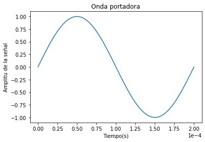
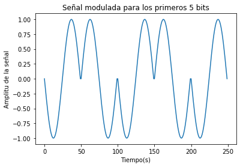
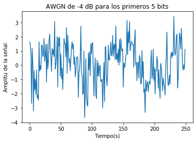
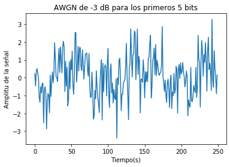
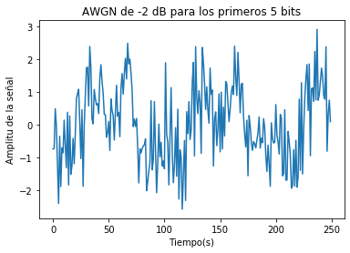
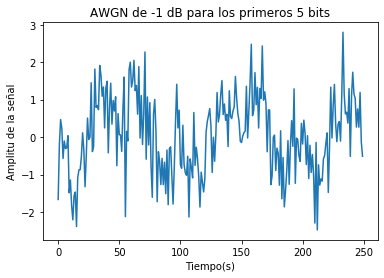
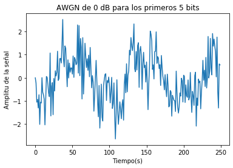
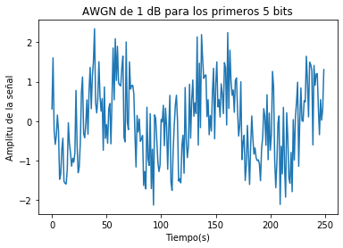
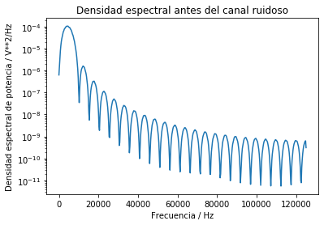
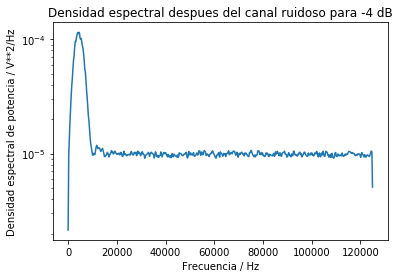

# **PROCEOS ALEATORIOS** 
 Universidad de Costa Rica\
 Modelos Probabilisticos de señales y sistemas\
 KEVIN PICADO SOTO A94779

## TAREA 4
### Situación
En el archivo bits10k.csv se encuentran 10.000 bits generados a partir de una fuente binaria equiprobable. El objetivo es hacer una modulación digital para "transmitir" estos datos por un canal ruidoso. La modulación se hace con una frecuencia en la portadora de   f = 5000 Hz y con 
un período de símbolo igual a un período completo de la onda portadora.

### Asignaciones
1. (20 %) Crear un esquema de modulación BPSK para los bits presentados. Esto implica asignar una forma de onda sinusoidal normalizada (amplitud unitaria) para cada bit y luego una concatenación de todas estas formas de onda.
2. (10 %) Calcular la potencia promedio de la señal modulada generada.
3. (20 %) Simular un canal ruidoso del tipo AWGN  con una relación señal a ruido (SNR) desde -2 hasta 3 dB.
4. (10 %) Graficar la densidad espectral de potencia de la señal con el método de Welch (SciPy), antes y después del canal ruidoso.
5. (20 %) Demodular y decodificar la señal y hacer un conteo de la tasa de error de bits (BER, bit error rate) para cada nivel SNR.
6. (20 %) Graficar BER versus SNR.

### Solución

### PUNTO 1

Se tiene una onda de forma senosoidal de amplitud 1  para los primero 5 bits muestreados en 50 puntos cada uno como se oberva el la figura, para esto establecemos los parametros de:

Frecuencia de la portadora: _**f =**_ 5000 Hz\
Periodo: _**T = 1/f**_ , el cual es equivalente a un período del símbolo y _**T**_ de la onda portadora

  

Ahora Se procede a generar la señal modulada BPSK, para obtenerla se adiga a la onda senosoidal (sen(x)) cuando el bit es 1 y su negativo (-sen(x)) cuando el bit es 0, esta manera para los primeros 5 bits a 50 puntos cada uno  se obtiene la siguiente señal:

### PUNTO 2

Para este inciso se cálculo de la potencia promedio de la señal modulada con :

  
donde sabemos que\
 

donde A es el operador de promedio temporal y X va ser la funcion senoidal establecida\
El resultado obtenido de la potencia promedio fue _**0.4900009800019598 W**_

### PUNTO 3
Con la potencia promedio obtenida en el punto 2 se aplica un canal de ruido AWGN (ruido aditivo blanco gaussiano) a la señal para analizar la relación, en decibeles,  señal::ruido que es el SNR (Signal-to-noise ratio) en un intervalo de valores de [-4,1] el cual se modifica del original para observar mas adelante el comportamieno de el error.\

sabemos que \

Donde Pprom la potencia promedio de la señal modulada y Pn es la potencia del ruido.

      

### PUNTO 4
En este punto se procede a graficar la densidad espectral de potencia de la señal antes y despues del canal ruidoso, en el caso de la densidad despues del canal AWGN se obtiene 
una grafica cada valor de SNR no obstante solo se muestra el correspondiente a -4dB.

### PUNTO 5
En este punto se establece            se utilizó un umbral definido por Ep>Es/2. En la imagen que se muestra a continuación se puede ver una gráfica de los errores respecto al nivel SNR.
_**T**_

