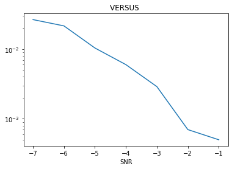

# **PROCEOS ALEATORIOS** 
 Universidad de Costa Rica\
 Modelos Probabilisticos de señales y sistemas\
 KEVIN PICADO SOTO A94779

## TAREA 4
### Situación
En el archivo bits10k.csv se encuentran 10.000 bits generados a partir de una fuente binaria equiprobable. El objetivo es hacer una modulación digital para "transmitir" estos datos por un canal ruidoso. La modulación se hace con una frecuencia en la portadora de   
f = 5000 Hz y con un período de símbolo igual a un período completo de la onda portadora.

### Asignaciones
1. (20 %) Crear un esquema de modulación BPSK para los bits presentados. Esto implica asignar una forma de onda sinusoidal normalizada (amplitud unitaria) para cada bit y luego una concatenación de todas estas formas de onda.
2. (10 %) Calcular la potencia promedio de la señal modulada generada.
3. (20 %) Simular un canal ruidoso del tipo AWGN  con una relación señal a ruido (SNR) desde -2 hasta 3 dB.
4. (10 %) Graficar la densidad espectral de potencia de la señal con el método de Welch (SciPy), antes y después del canal ruidoso.
5. (20 %) Demodular y decodificar la señal y hacer un conteo de la tasa de error de bits (BER, bit error rate) para cada nivel SNR.
6. (20 %) Graficar BER versus SNR.

### Solución

### PUNTO 1

